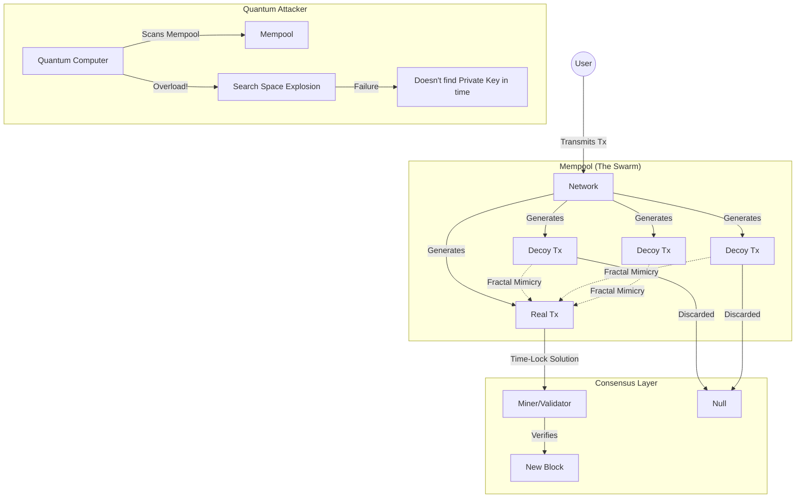

# 🛡️ BIP 888: Entropic Swarm Shield (ESS) 🛡️🧠

---
### 🗺️ Project Roadmap & Navigation
[🔭 Overview](./README.md) → [📜 Whitepaper](./WHITEPAPER.md) → [🔢 Math](./MATH_MODEL.md) → [🧬 Guidelines](./GUIDELINES.md) → [🧪 Demo](https://capgorack.github.io/Bip888/)
---

[🌐 **Português (Brasil)**](./docs/pt-br/README.md) | 🇺🇸 **English**

[](LICENSE)
[](https://capgorack.github.io/Bip888/)
[](WHITEPAPER.md)
[](WHITEPAPER.md)

> **"The authenticity of this proposal lies in its mathematical capacity to survive chaos."**

## 🌌 Overview

**BIP 888** (Entropic Swarm Shield) is a revolutionary active defense protocol designed to protect Bitcoin against quantum computing threats (specifically Shor's and Grover's algorithms) without requiring immediate hard forks to Post-Quantum Cryptography (PQC).

Instead of just strengthening the cryptographic lock, **ESS** utilizes the distributed power of the validator network to generate a "Fractal Mimicry" field—a massive storm of false transactions (decoys) that neutralize quantum advantage through brute force entropy. By utilizing **Compact Seed Propagation** and **Receiver-PoW**, the protocol achieves this with near-zero network overhead (36 bytes), shifting the defensive effort to local computational inertia.

### 📄 Technical Documentation & PoC
- 🇺🇸 [**English Whitepaper (BIP Draft)**](./WHITEPAPER.en.md)
- 🇧🇷 [**Whitepaper in Portuguese**](./docs/pt-br/WHITEPAPER.md)
- 🧪 [**Mathematical Model & Proof of Concept**](./simulation/) | [**Math Docs**](./MATH_MODEL.md)
- 🧪 [**Entropy Guidelines (EN)**](./GUIDELINES.en.md) | [**Guidelines (PT)**](./docs/pt-br/GUIDELINES.md)

---

## 🧠 How It Works

### The Concept: Asymmetric Entropy
A Quantum Computer has a quadratic advantage in searching for static targets. **ESS** turns the network into a high-uncertainty dynamic environment.



### ⚡ Security Hierarchy and Hashrate
BIP 888 activates the collective force of the Bitcoin network in two fundamental layers:
1. **Obfuscation Layer (Mempool):** The introduction of massive entropy ensures that the quantum search time ($T_{search}$) exceeds the average block confirmation time.
2. **Immutability Layer (Blockchain):** After confirmation, the transaction is protected by global Hashrate. Reversing this layer requires an energy expenditure that negates quantum computation benefits in rewrite attacks.
3. **Dynamic Scaling:** BIP 888 is not a static limit. As quantum hardware improves, the network simply increases $N$ (entropy density), maintaining the security margin with near-zero impact on permanent storage.
4. **Scalability:** Utilizes **Compact Decoys** (sending seeds, not data) and **Receiver-PoW** to ensure trivial bandwidth impact (< 1% overhead) while maintaining maximal entropic shielding.

---

## 📊 The Visualizer (Dashboard)

Included in this repository is a modern **Quantum Resistance Dashboard**:
- **Scientific Realism:** Simulations based on Grover's Algorithm complexity ($\pi/4 \sqrt{N}$).
- **Stress Analysis:** Test system behavior with the theoretical ceiling of **20 Million Qubits**.
- **Dynamic Warnings:** Immediate visual feedback for extreme or non-human parameters.
- **Network Benchmark:** Real-time **Proof-of-Compact** tool measuring actual CPU inflation time and Bandwidth savings (32 bytes vs 25MB). [See Verification Methodology](./WHITEPAPER.md#7-network-impact-verification-benchmark)


---

## 🗺️ Project Roadmap

- [x] **Phase 1: Conceptualization**
    - [x] Bilingual Whitepaper (BIP Standard)
    - [x] Fractal Entropy Thesis
- [x] **Phase 2: Core Simulation**
    - [x] Modular Python Implementation
    - [x] Crack-time benchmark verification
- [x] **Phase 3: Visualization**
    - [x] Real-time React + Vite Dashboard
    - [x] Realism Warning & Hashrate Synergy systems

---

## 🚀 How to Run (Visualizer)
### 🌐 Live Demo (Recommended)
Access the live simulation directly in your browser without installation:
👉 **[Launch BIP 888 Visualizer](https://capgorack.github.io/Bip888/)**

### 💻 Local Installation
To run the development environment locally:

The visualizer is built with **React + Vite**. To run it locally:

1. **Install Dependencies:**
   ```bash
   cd visualizer
   npm install
   ```

2. **Start Dev Server:**
   ```bash
   npm run dev
   ```
3. Open `http://localhost:5173` (or the port shown in your terminal).

---

## 🤝 Contributing

This is a proposal to strengthen Bitcoin's sovereignty. Technical contributions are welcome.

1. Fork the Project
2. Create your Feature Branch (`git checkout -b feature/AmazingFeature`)
3. Commit your Changes (`git commit -m 'Add some AmazingFeature'`)
4. Open a Pull Request

## 📜 License

Distributed under the BSD 2-Clause License. See `LICENSE` for more information.

---
*"The authenticity of this proposal lies in its mathematical capacity to survive chaos."*
**Copyright © 2026 Éve Sk > CapGorack**
