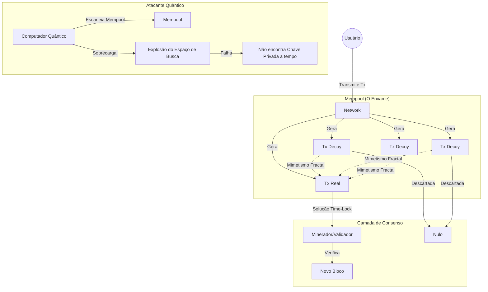

# 🛡️ BIP 888: Entropic Swarm Shield (ESS) 🛡️🧠

🌐 [English](../../README.md) | 🇧🇷 **Português (Brasil)**

[](../../LICENSE)
[](./WHITEPAPER.md)
[](./WHITEPAPER.md)

> **"A autenticidade desta proposta reside na sua capacidade matemática de sobreviver ao caos."**

## 🌌 Visão Geral

**BIP 888** (Escudo de Enxame Entrópico) é um protocolo de defesa ativa revolucionário projetado para proteger o Bitcoin contra ameaças de computação quântica (especificamente os algoritmos de Shor e Grover) sem exigir hard forks imediatos para Criptografia Pós-Quântica (PQC).

Em vez de apenas fortalecer a fechadura criptográfica, o **ESS** utiliza o poder distribuído da rede de validadores para gerar um campo de "Mimetismo Fractal" — uma tempestade massiva de transações falsas (decoys) que neutralizam a vantagem quântica através da força bruta da entropia e inércia computacional.

### 📄 Documentação Técnica e PoC
- 🇺🇸 [**English Whitepaper (BIP Draft)**](../../WHITEPAPER.md)
- 🇧🇷 [**Whitepaper em Português**](./WHITEPAPER.md)
- 🧪 [**Modelo Matemático & Prova de Conceito**](../../simulation/) | [**Documentação Matemática**](./MATH_MODEL.md)
- 🧪 [**Diretrizes de Entropia (PT)**](./GUIDELINES.md) | [**Entropy Guidelines (EN)**](../../GUIDELINES.en.md)

---

## 🧠 Como Funciona

### O Conceito: Entropia Assimétrica
Um Computador Quântico possui uma vantagem quadrática na busca por alvos estáticos. O **ESS** transforma a rede em um ambiente dinâmico de alta incerteza.



### ⚡ Hierarquia de Segurança e Hashrate
O BIP 888 ativa a força coletiva da rede Bitcoin em duas camadas fundamentais:
1. **Camada de Ofuscação (Mempool):** A introdução de entropia massiva garante que o tempo de busca quântica ($T_{search}$) exceda o tempo médio de confirmação de um bloco.
2. **Camada de Imutabilidade (Blockchain):** Após a confirmação, a transação é protegida pelo Hashrate global. A reversão desta camada exige um dispêndio energético que neutraliza benefícios da computação quântica em ataques de reescrita.
3. **Escalabilidade Dinâmica:** O BIP 888 não é um limite estático. Conforme o hardware quântico evolui, a rede simplesmente aumenta $N$ (densidade de entropia), mantendo a margem de segurança com impacto mínimo no armazenamento permanente.

---

## 📊 O Simulador (Visualizer)

Neste repositório, incluímos um **Quantum Resistance Dashboard** moderno:
- **Realismo Científico:** Simulações baseadas na complexidade do Algoritmo de Grover ($\pi/4 \sqrt{N}$).
- **Análise de Estresse:** Teste o comportamento do sistema com o teto teórico de **20 Milhões de Qubits**.
- **Análise de Estresse:** Teste o comportamento do sistema com o teto teórico de **20 Milhões de Qubits**.
- **Avisos Dinâmicos:** Feedback visual imediato para parâmetros extremos ou não-humanos.
- **Benchmark de Rede:** Ferramenta de **Proof-of-Compact** em tempo real medindo o tempo de inflação de CPU e economia de banda (32 bytes vs 25MB).


---

## 🗺️ Mapa do Projeto (Roadmap)

- [x] **Fase 1: Conceitualização**
    - [x] Whitepaper Bilíngue (BIP Standard)
    - [x] Tese de Entropia Fractal
- [x] **Fase 2: Simulação Core**
    - [x] Implementação modular em Python
    - [x] Verificação de benchmarks de tempo de quebra
- [x] **Fase 3: Visualização**
    - [x] Painel React + Vite em Tempo Real
    - [x] Sistema de Avisos de Realismo e Sinergia de Hashrate

---

## 🚀 Como Executar (Visualizer)
### 🌐 Demonstração ao Vivo (Recomendado)
Acesse a simulação diretamente no seu navegador, sem instalação:
👉 **[Iniciar BIP 888 Visualizer](https://capgorack.github.io/bip888/)**

### 💻 Instalação Local
Para rodar o ambiente de desenvolvimento:

O visualizador foi construído com **React + Vite**. Para rodar localmente:

1. **Instalar Dependências:**
   ```bash
   cd visualizer
   npm install
   ```

2. **Iniciar Servidor de Desenvolvimento:**
   ```bash
   npm run dev
   ```
3. Abra `http://localhost:5173` (ou a porta exibida no terminal).

---

## 🤝 Contribuindo

Esta é uma proposta para fortalecer a soberania do Bitcoin. Contribuições técnicas são bem-vindas.

1. Faça um Fork do Projeto
2. Crie sua Branch de Feature (`git checkout -b feature/RecursoIncrivel`)
3. Commite suas Mudanças (`git commit -m 'Adiciona algum RecursoIncrivel'`)
4. Abra um Pull Request

## 📜 Licença

Distribuído sob a Licença BSD de 2 Cláusulas. Veja `LICENSE` para mais informações.

---
*"A autenticidade desta proposta reside na sua capacidade matemática de sobreviver ao caos."*
**Copyright © 2026 Éve Sk > CapGorack**
